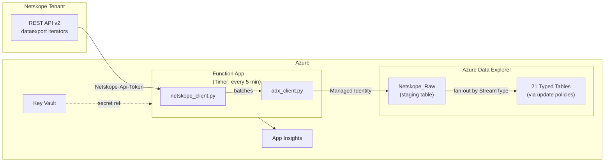

# Netskope to Azure Data Explorer (ADX) Ingestion

[](https://learn.microsoft.com/en-us/azure/azure-functions/)
[](https://docs.netskope.com/en/rest-api-v2-overview/)
[](https://learn.microsoft.com/en-us/azure/data-explorer/)

Azure Function App that polls Netskope REST API v2 dataexport iterators every 5 minutes and ingests events and alerts into Azure Data Explorer.

---

## Architecture



## Supported Streams (21 total)

| Category | Streams | Count |
|---|---|---|
| **Events** | `page`, `application`, `audit`, `infrastructure`, `network`, `connection`, `endpoint`, `incident` | 8 |
| **Alerts** | `remediation`, `compromisedcredential`, `uba`, `securityassessment`, `quarantine`, `policy`, `malware`, `malsite`, `dlp`, `ctep`, `watchlist`, `device`, `content` | 13 |

Each stream is independently toggleable via app settings (`Yes`/`No`). Disabled streams are skipped at zero cost.

---

## Repository Structure

```
N2Av2/
├── function_app.py                # Timer trigger, stream orchestration
├── requirements.txt               # Python dependencies
├── main.bicep                     # Bicep template (Function App + Storage + App Insights + Key Vault)
├── host.json                      # Azure Functions host config
├── local.settings.template.json   # App settings template (DO NOT commit with real tokens)
├── utils/
│   ├── __init__.py
│   ├── netskope_client.py         # Netskope v2 dataexport iterator client
│   └── adx_client.py              # ADX queued ingestion client (Managed Identity)
└── adx/
    └── tables/
        ├── 01_create_raw_table_v2.kql      # Netskope_Raw staging table + retention
        ├── 02_create_mapping_v2.kql        # JSON ingestion mapping
        ├── 03_create_typed_tables_v2.kql   # 21 typed tables + retention
        └── 04_create_update_policies_v2.kql # Transform functions + update policies
```

---

## Prerequisites

| Requirement | Details |
|---|---|
| Netskope tenant | REST API v2 token with dataexport permissions |
| Azure subscription | Resource group with Contributor access |
| ADX cluster | Existing cluster + database (Dev/Test SKU works for testing) |
| Azure CLI | With Bicep support (`az bicep install`) |
| Azure Functions Core Tools | For local testing and code deployment (`func` CLI) |

---

## Deployment

### Step 1 -- Set up ADX tables

Run the KQL files **in order** against your ADX database (via Kusto Web Explorer or the ADX portal):

```
01_create_raw_table_v2.kql       -> Netskope_Raw + 90-day retention
02_create_mapping_v2.kql         -> JSON ingestion mapping
03_create_typed_tables_v2.kql    -> 21 typed tables + retention
04_create_update_policies_v2.kql -> Transform functions + update policies
```

Order matters -- update policies reference tables that must exist first.

### Step 2 -- Deploy Azure infrastructure

```bash
az deployment group create \
  --resource-group <YOUR_RG> \
  --template-file main.bicep \
  --parameters \
    functionAppName=<NAME> \
    storageAccountName=<STORAGE_NAME> \
    appInsightsName=<AI_NAME> \
    adxClusterUri=https://<CLUSTER>.<REGION>.kusto.windows.net \
    adxDatabaseName=<DB_NAME> \
    netskopeHostname=<TENANT>.goskope.com \
    netskopeApiToken=<YOUR_V2_TOKEN> \
    keyVaultName=<KV_NAME> \
    ingestEventsPage=Yes \
    ingestEventsApplication=Yes \
    ingestAlertsPolicy=Yes \
    ingestAlertsMalware=Yes \
    ingestAlertsDlp=Yes
```

The `keyVaultOption` parameter controls how the API token is stored:

- `create` (default) -- deploys a new Key Vault and stores the token as a secret
- `existing` -- references a secret already in your Key Vault
- `none` -- plaintext app setting (dev/test only)

The deployment outputs a `grantAdxIngestorRole` command. **Copy and run it in ADX** -- without it, data silently fails to ingest:

```kusto
.add database <DB> ingestors ('aadapp=<PRINCIPAL_ID>')
```

### Step 3 -- Deploy function code

```bash
func azure functionapp publish <YOUR_FUNCTION_APP_NAME>
```

### Step 4 -- Verify

After roughly 10 minutes (queued ingestion latency), check ADX:

```kusto
Netskope_Raw
| take 10

NetskopeEventsPage
| take 10
```

---

## Key Design Decisions

- **Staging table pattern** -- all 21 streams land in `Netskope_Raw` first. Single ingestion target, replay capability, schema evolution decoupled from API.
- **Dynamic `RawData` column** -- typed tables store the full payload as `dynamic`. No per-type schema to maintain. Query with `| extend user = tostring(RawData.user)`.
- **Per-batch error handling** -- a failed batch does not block subsequent batches. Prevents the iterator from advancing past data that was never ingested.
- **Server-side stateful iterators** -- Netskope tracks position per index name. No local checkpoint files needed.
- **Auto iterator creation** -- handles tenants that require explicit creation (409/400 gracefully ignored).
- **Key Vault integration** -- API token referenced via `@Microsoft.KeyVault(SecretUri=...)`. No plaintext secrets in production.

---

## Configuration Reference

### Core Settings

| Setting | Required | Example |
|---|---|---|
| `NetskopeHostname` | Yes | `mytenant.goskope.com` |
| `NetskopeApiToken` | Yes | v2 REST API token (stored in Key Vault) |
| `NetskopeIndex` | No | `NetskopeADX` (default) |
| `ADX_CLUSTER_URI` | Yes | `https://cluster.region.kusto.windows.net` |
| `ADX_DATABASE` | Yes | `NetskopeDB` |
| `LOG_LEVEL` | No | `INFO` (default). Options: `DEBUG`, `INFO`, `WARNING`, `ERROR` |
| `AZURE_LOG_LEVEL` | No | `WARNING` (default). Set to `INFO` for verbose Kusto SDK logging |

### Stream Toggles

Set to `Yes` to enable, `No` to disable. Defaults are set in the Bicep template.

**Events** (defaults: page/application/audit = Yes, rest = No):
`IngestEventsPage`, `IngestEventsApplication`, `IngestEventsAudit`, `IngestEventsInfrastructure`, `IngestEventsNetwork`, `IngestEventsConnection`, `IngestEventsEndpoint`, `IngestEventsIncident`

**Alerts** (defaults: policy/malware/malsite/dlp = Yes, rest = No):
`IngestAlertsRemediation`, `IngestAlertsCompromisedCredential`, `IngestAlertsUba`, `IngestAlertsSecurityAssessment`, `IngestAlertsQuarantine`, `IngestAlertsPolicy`, `IngestAlertsMalware`, `IngestAlertsMalsite`, `IngestAlertsDlp`, `IngestAlertsCtep`, `IngestAlertsWatchlist`, `IngestAlertsDevice`, `IngestAlertsContent`

---

## ADX Table Retention

| Table Group | Retention | Count |
|---|---|---|
| `Netskope_Raw` (staging) | 90 days | 1 |
| Event tables | 180 days | 8 |
| Alert tables | 365 days | 13 |

---

## Gotchas

- **Iterator names are permanent.** Deleting and recreating with the same name may cause missed data or duplicates. Use unique index names per consumer.
- **`dlp` is an alert subtype**, not an event type.
- **Queued ingestion latency** is 5-10 minutes. This is normal ADX behavior.
- **Run the `grantAdxIngestorRole` command** from the Bicep output or data silently fails.
- **`device`/`content`/`incident`** availability varies by Netskope tenant and license tier. Per-batch error handling means unsupported endpoints will not break other streams.
- **Linux Consumption plan** is being retired Sept 2028. Plan migration to Flex Consumption.
- Check your Netskope Swagger docs at `https://<tenant>.goskope.com/apidocs/` to verify available endpoints.

---

## License

MIT
