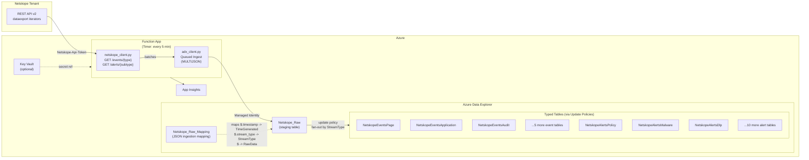
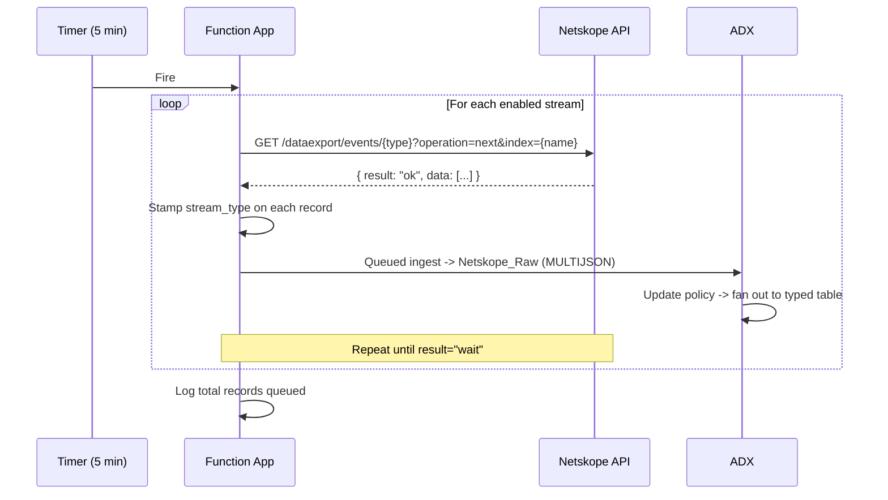

# Netskope → Azure Data Explorer (ADX) Ingestion

[](https://learn.microsoft.com/en-us/azure/azure-functions/)
[](https://docs.netskope.com/en/rest-api-v2-overview/)
[](https://learn.microsoft.com/en-us/azure/data-explorer/)

An Azure Function App that polls Netskope's REST API v2 dataexport iterator endpoints every 5 minutes and ingests events and alerts directly into Azure Data Explorer — **bypassing Microsoft Sentinel / Log Analytics entirely**.

Built as a direct replacement for the [Netskope v2 Sentinel connector](https://github.com/Azure/Azure-Sentinel/tree/master/Solutions/Netskopev2), re-targeted for ADX-native storage and querying.

---

## Architecture



## Supported Streams (21 total)

| Category | Streams | Count |
|---|---|---|
| **Events** | `page`, `application`, `audit`, `infrastructure`, `network`, `connection`, `endpoint`, `incident` | 8 |
| **Alerts** | `remediation`, `compromisedcredential`, `uba`, `securityassessment`, `quarantine`, `policy`, `malware`, `malsite`, `dlp`, `ctep`, `watchlist`, `device`, `content` | 13 |

Each stream is independently toggleable via app settings (`Yes`/`No`). Disabled streams are skipped at zero cost.

---

## Repository Structure

```
N2Av2/
├── function_app.py                # Main entry point — timer trigger, stream orchestration
├── requirements.txt               # Python dependencies (pin ranges)
├── main.bicep                     # Bicep template — Function App + Storage + App Insights + Key Vault
├── host.json                      # Azure Functions host config (10-min timeout)
├── local.settings.template.json   # App settings template — DO NOT commit with real tokens
├── .gitignore                     # Prevents committing local.settings.json and build artifacts
├── CLAUDE.md                      # Developer reference & design decisions
├── README.md                      # You are here
├── utils/
│   ├── __init__.py
│   ├── netskope_client.py         # Netskope v2 dataexport iterator client (GET + retry)
│   └── adx_client.py              # ADX queued ingestion client (Managed Identity)
└── adx/
    └── tables/
        ├── 01_create_raw_table_v2.kql      # Netskope_Raw staging table + retention
        ├── 02_create_mapping_v2.kql        # JSON ingestion mapping (CRITICAL)
        ├── 03_create_typed_tables_v2.kql   # 21 typed tables + folder org + retention
        └── 04_create_update_policies_v2.kql # Transform functions + update policies
```

---

## Prerequisites

| Requirement | Details |
|---|---|
| **Netskope tenant** | REST API v2 token with dataexport permissions |
| **Azure subscription** | Resource group with Contributor access |
| **ADX cluster** | Existing cluster + database (Dev/Test SKU is fine for testing) |
| **Azure CLI** | With Bicep support (`az bicep install`) |
| **Azure Functions Core Tools** | For local testing and code deployment (`func` CLI) |

---

## Deployment

### Step 1 — Set up ADX tables

Run KQL files **in order** against your ADX database (via Kusto Web Explorer or Azure Data Explorer portal):

```
01_create_raw_table_v2.kql       -> Creates Netskope_Raw + 90-day retention
02_create_mapping_v2.kql         -> Creates Netskope_Raw_Mapping (JSON -> columns)
03_create_typed_tables_v2.kql    -> Creates 21 typed tables + folder org + retention
04_create_update_policies_v2.kql -> Creates transform functions + update policies
```

> **Order matters.** Update policies reference tables that must exist first.

### Step 2 — Deploy Azure infrastructure

The Bicep template supports three Key Vault modes via `keyVaultOption`:
- `none` — plaintext app setting (dev/test only)
- `existing` — reference a secret already in your Key Vault
- `create` — deploy a new Key Vault and store the token (default, recommended)

```bash
az deployment group create \
  --resource-group <YOUR_RG> \
  --template-file main.bicep \
  --parameters \
    functionAppName=<NAME> \
    storageAccountName=<STORAGE_NAME> \
    appInsightsName=<AI_NAME> \
    adxClusterUri=https://<CLUSTER>.<REGION>.kusto.windows.net \
    adxDatabaseName=<DB_NAME> \
    netskopeHostname=<TENANT>.goskope.com \
    netskopeApiToken=<YOUR_V2_TOKEN> \
    keyVaultName=<KV_NAME> \
    ingestEventsPage=Yes \
    ingestEventsApplication=Yes \
    ingestAlertsPolicy=Yes \
    ingestAlertsMalware=Yes \
    ingestAlertsDlp=Yes
```

The Bicep template outputs a `grantAdxIngestorRole` command — **copy and run it in ADX**:

```kusto
.add database <DB> ingestors ('aadapp=<PRINCIPAL_ID>')
```

> **This step is required.** Without it, data silently fails to ingest.

### Step 3 — Deploy function code

```bash
func azure functionapp publish <YOUR_FUNCTION_APP_NAME>
```

### Step 4 — Verify

After ~10 minutes (queued ingestion latency), check ADX:

```kusto
Netskope_Raw
| take 10

NetskopeEventsPage
| take 10
```

---

## How It Works



**Key design decisions:**

- **Staging table pattern** — all 21 streams land in `Netskope_Raw` first. Single ingestion target, replay capability, schema evolution decoupled from API.
- **Dynamic `RawData` column** — typed tables store the full payload as `dynamic`. No per-type schema maintenance. Query with `| extend user = tostring(RawData.user)`.
- **Per-batch error handling** — if one ADX ingest batch fails, the next batch still runs. Prevents the Netskope iterator from advancing past data we never ingested.
- **Server-side stateful iterators** — Netskope tracks position per index name. No local checkpoint files needed.
- **Auto iterator creation** — handles tenants that require explicit creation (409/400 gracefully ignored).
- **Key Vault integration** — API token stored as a Key Vault secret, referenced via `@Microsoft.KeyVault(SecretUri=...)` in app settings. No plaintext secrets in production.

---

## Configuration Reference

### Core Settings

| Setting | Required | Example |
|---|---|---|
| `NetskopeHostname` | Yes | `mytenant.goskope.com` |
| `NetskopeApiToken` | Yes | v2 REST API token (stored in Key Vault) |
| `NetskopeIndex` | No | `NetskopeADX` (default) |
| `ADX_CLUSTER_URI` | Yes | `https://cluster.region.kusto.windows.net` |
| `ADX_DATABASE` | Yes | `NetskopeDB` |
| `LOG_LEVEL` | No | `INFO` (default). Options: `DEBUG`, `INFO`, `WARNING`, `ERROR` |
| `AZURE_LOG_LEVEL` | No | `WARNING` (default). Set to `INFO` for verbose Kusto SDK logging |

### Stream Toggles

Default values are set in the Bicep template. Set to `Yes` to enable, `No` to disable.

**Events (defaults: page/application/audit = Yes, rest = No):**
`IngestEventsPage`, `IngestEventsApplication`, `IngestEventsAudit`, `IngestEventsInfrastructure`, `IngestEventsNetwork`, `IngestEventsConnection`, `IngestEventsEndpoint`, `IngestEventsIncident`

**Alerts (defaults: policy/malware/malsite/dlp = Yes, rest = No):**
`IngestAlertsRemediation`, `IngestAlertsCompromisedCredential`, `IngestAlertsUba`, `IngestAlertsSecurityAssessment`, `IngestAlertsQuarantine`, `IngestAlertsPolicy`, `IngestAlertsMalware`, `IngestAlertsMalsite`, `IngestAlertsDlp`, `IngestAlertsCtep`, `IngestAlertsWatchlist`, `IngestAlertsDevice`, `IngestAlertsContent`

---

## ADX Table Organization

| Table Group | Retention | Count |
|---|---|---|
| `Netskope_Raw` (staging) | 90 days | 1 |
| Event tables | 180 days | 8 |
| Alert tables | 365 days | 13 |

---

## Differences from the Sentinel Connector

| Area | Sentinel v2 Connector | This Project (ADX-native) |
|---|---|---|
| Destination | Log Analytics workspace | Azure Data Explorer |
| API endpoint | `/api/v2/events/data/{type}` (time-range) | `/api/v2/events/dataexport/{events\|alerts}/{type}` (iterator) |
| HTTP method | POST + JSON body | GET + query params |
| Auth header | `Netskope-Token` | `Netskope-Api-Token` |
| Alerts | Single unified stream | Per-subtype endpoints (13 separate) |
| `dlp` stream | Listed as event type (wrong) | Correctly placed as alert subtype |
| Error handling | Per-stream (data loss on failure) | Per-batch (resilient) |
| Retry logic | None | urllib3 Retry with backoff on 429/5xx |
| Ingestion mapping | Missing (data malformed) | `Netskope_Raw_Mapping` with epoch->datetime transform |
| Schema approach | Flattened columns per table | `dynamic RawData` — query-time schema |
| Stream count | 17 (missing 4) | 21 (complete) |
| Secret management | Plaintext app setting | Key Vault integration (optional) |
| IaC | ARM JSON | Bicep |

---

## Gotchas & Troubleshooting

- **Iterator names are permanent.** If you delete and recreate with the same name, you may miss data or get duplicates. Use unique index names per consumer.
- **`dlp` is an alert subtype**, not an event type. The Sentinel connector had this wrong.
- **Queued ingestion latency** is 5-10 minutes. This is normal ADX behavior.
- **Run the `grantAdxIngestorRole` command** from the Bicep output. Without it, data silently fails.
- **`device`/`content`/`incident`** endpoint availability varies by Netskope tenant/license tier. Per-batch error handling means unsupported endpoints won't break other streams.
- **Linux Consumption plan** is being retired Sept 2028. Plan migration to Flex Consumption.
- Check your Netskope Swagger docs at `https://<tenant>.goskope.com/apidocs/` to verify available endpoints.

---

## License

MIT
